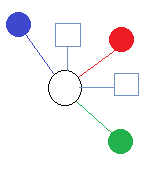

#Poiesis: An application generator.

__Poiesis__ (see [Poiesis](https://en.wikipedia.org/wiki/Poiesis) ) is a single page application generator, the generated app will use [React](https://en.wikipedia.org/wiki/React_(JavaScript_library)) and [Mui](https://mui.com/) to build the frontend , [Quarkus](https://en.wikipedia.org/wiki/Quarkus) to create the REST API layer, [Helm](https://helm.sh/) and [Kustomize](https://kustomize.io/) to  manage the deploymet of the microservices to a [Kubernetes](https://en.wikipedia.org/wiki/Kubernetes) cluster.
In order to achieve the aforementioned goals __Poiesis__ will read a [Markdown](https://en.wikipedia.org/wiki/Markdown) file called __README.md__ that will be located at the project's root directory. This file shall have a special structure that will contain all the information needed to complete the following steps:

* Create a new eclipse workspace containing all the folders needed to host all the related projects.
* For every entity mentioned in the __README.md__ file __Poiesis__ will create a __Quarkus__ proyect with a list of  [CRUD](https://en.wikipedia.org/wiki/Create,_read,_update_and_delete) endpoints.
* Will generate all the endpoints needed to implement security, authorization and autentication.
* Will generate all the Helm and Kustomize [YAML](https://en.wikipedia.org/wiki/YAML) files needed.
* Will generate the Dockerfiles needed for [Docker](https://www.docker.com/) to create an image for every endpoint.
* Will generate the frontend application using React and MUI.
* Will generate the Dockerfile needed for [Docker](https://www.docker.com/) to publish the single page application from the same kubernetes cluster.
* Will use [Flyaway](https://flywaydb.org/) to manage database migractions.
* Will generate scripts to start, update, stop and delete the local cluster. 

